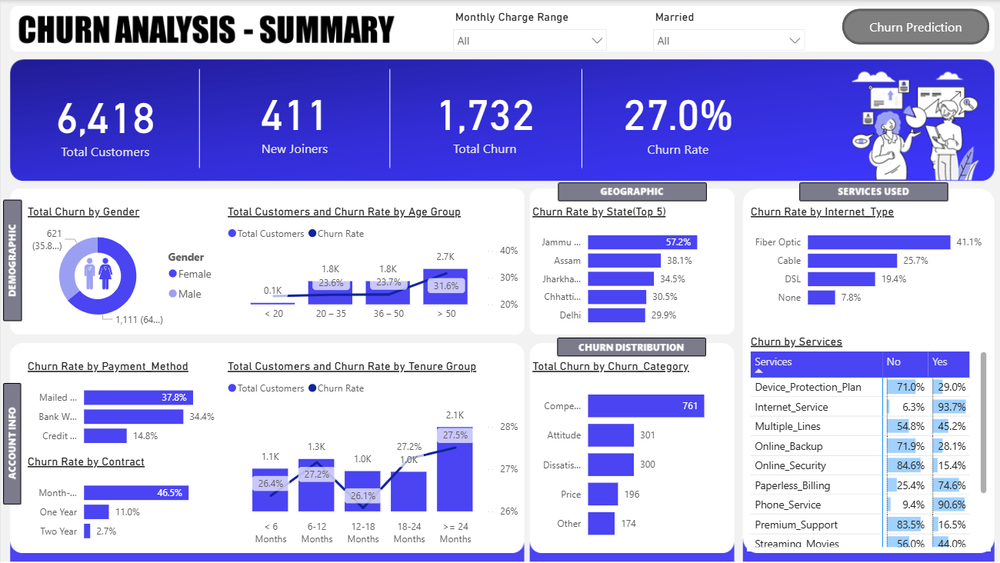
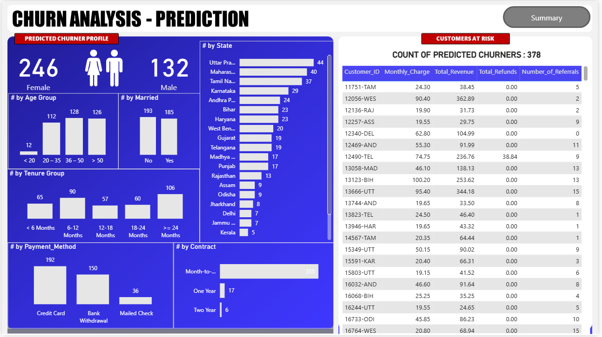

# End-to-End Telecom Churn Analysis (ETL + BI + ML)

An end-to-end churn analysis and prediction system leveraging ETL, BI dashboards, and machine learning to help telecom companies reduce customer loss.

## 1. Introduction

Telecom churn analysis helps companies identify why customers leave the service and what factors influence churn. This project analyzes customer behavior, usage patterns, plan characteristics, and demographic features to uncover key drivers of churn and propose data-driven retention strategies.

## 2. Problem Statement-- Check the Logs

This project aims to address the following key business questions:

**1. What are the major reasons customers stop using telecom services?**
<br>
**2. Which customer segments or service attributes contribute the most to churn?**
<br>
**3. How can the company reduce churn and improve long-term customer retention?**
<br>
**4. What factors are the strongest predictors of future churn?**

## 3. Objectives

The primary objective of this project is to build a complete **ETL → Analysis → Visualization → Prediction** workflow to help the telecom business understand and reduce customer churn. Key goals include:

- **Design and implement a full ETL pipeline** to clean, transform, and store customer data in a SQL database.
<br>
- **Visualize and analyze customer data across** demographic, geographic, account, payment, and service-related attributes.

- **Identify churn-prone customer profiles** to support targeted marketing and retention campaigns.
<br>
- **Develop a predictive churn model** to identify customers likely to leave in the future using machine learning.

## 4. Dataset Description

**Source:** PivotalStats (Data Resources Pack)
[Download Link](https://pivotalstats.com/wp-content/uploads/2024/08/Data-Resources.zip)

The dataset includes **6,419 customer records** with **32 attributes**, covering:

- Demographics
<br>
- Contract details
<br>
- Payment methods
<br>
- Service usage
<br>
- Churn category & reason
<br>
- Revenue-related fields

This dataset provides a comprehensive view of customer behavior suitable for churn analysis and prediction.

## 5. Skills and Tools Used

***✔ Skills:***


- **Python**(ETL, EDA, Feature Engineering, ML)

- **MySQL / SQL Server** (Database Design, ETL, Data Modelling)

- **Data Cleaning & Transformation**

- **Statistical Analysis**

- **DAX (Power BI Measures)**

- **Data Visualization & Dashboarding**

- **Machine Learning** (Random Forest Classifier)

- **Feature Importance Analysis**

<br>

***✔ Tools***
<br>

- **Jupyter Notebook** <br>
- **SQL Server Management Studio** (SSMS)
- **Power BI**
- **Python Libraries:** 

  - pandas, numpy
    <br>
  - matplotlib, seaborn
    <br>
  - scikit-learn
    <br>
  - joblib

## 6. Methodology

The project follows a complete ETL → Analysis → BI Visualization → ML Model → Prediction approach.

**Note:** *A detail set of project execution is give in the article [here](https://pivotalstats.com/courses/telecom-churn-analysis/ )*

### 6.1 Data Exploration (SQL)
✔ Check Distinct Values
```sql
SELECT Gender, COUNT(Gender) AS TotalCount,
       COUNT(Gender) * 1.0 / (SELECT COUNT(*) FROM stg_Churn) AS Percentage
FROM stg_Churn
GROUP BY Gender;
```
```sql
SELECT Contract, COUNT(Contract) AS TotalCount,
       COUNT(Contract) * 1.0 / (SELECT COUNT(*) FROM stg_Churn) AS Percentage
FROM stg_Churn
GROUP BY Contract;
```

```sql

SELECT Customer_Status, COUNT(Customer_Status) AS TotalCount,
       SUM(Total_Revenue) AS TotalRev,
       SUM(Total_Revenue) * 100.0 / (SELECT SUM(Total_Revenue) FROM stg_Churn) AS RevPercentage
FROM stg_Churn
GROUP BY Customer_Status;
```

```sql

SELECT State, COUNT(State) AS TotalCount,
       COUNT(State) * 1.0 / (SELECT COUNT(*) FROM stg_Churn) AS Percentage
FROM stg_Churn
ORDER BY Percentage DESC;
```
✔ Check Null Values
```sql

SELECT 
    SUM(CASE WHEN Customer_ID IS NULL THEN 1 ELSE 0 END) AS Customer_ID_Null_Count,
    SUM(CASE WHEN Gender IS NULL THEN 1 ELSE 0 END) AS Gender_Null_Count,
    SUM(CASE WHEN Age IS NULL THEN 1 ELSE 0 END) AS Age_Null_Count,
    SUM(CASE WHEN Married IS NULL THEN 1 ELSE 0 END) AS Married_Null_Count,
    SUM(CASE WHEN State IS NULL THEN 1 ELSE 0 END) AS State_Null_Count,
    SUM(CASE WHEN Number_of_Referrals IS NULL THEN 1 ELSE 0 END) AS Number_of_Referrals_Null_Count,
    SUM(CASE WHEN Tenure_in_Months IS NULL THEN 1 ELSE 0 END) AS Tenure_in_Months_Null_Count,
    SUM(CASE WHEN Value_Deal IS NULL THEN 1 ELSE 0 END) AS Value_Deal_Null_Count,
    SUM(CASE WHEN Phone_Service IS NULL THEN 1 ELSE 0 END) AS Phone_Service_Null_Count,
    SUM(CASE WHEN Multiple_Lines IS NULL THEN 1 ELSE 0 END) AS Multiple_Lines_Null_Count,
    SUM(CASE WHEN Internet_Service IS NULL THEN 1 ELSE 0 END) AS Internet_Service_Null_Count,
    SUM(CASE WHEN Internet_Type IS NULL THEN 1 ELSE 0 END) AS Internet_Type_Null_Count,
    SUM(CASE WHEN Online_Security IS NULL THEN 1 ELSE 0 END) AS Online_Security_Null_Count,
    SUM(CASE WHEN Online_Backup IS NULL THEN 1 ELSE 0 END) AS Online_Backup_Null_Count,
    SUM(CASE WHEN Device_Protection_Plan IS NULL THEN 1 ELSE 0 END) AS Device_Protection_Plan_Null_Count,
    SUM(CASE WHEN Premium_Support IS NULL THEN 1 ELSE 0 END) AS Premium_Support_Null_Count,
    SUM(CASE WHEN Streaming_TV IS NULL THEN 1 ELSE 0 END) AS Streaming_TV_Null_Count,
    SUM(CASE WHEN Streaming_Movies IS NULL THEN 1 ELSE 0 END) AS Streaming_Movies_Null_Count,
    SUM(CASE WHEN Streaming_Music IS NULL THEN 1 ELSE 0 END) AS Streaming_Music_Null_Count,
    SUM(CASE WHEN Unlimited_Data IS NULL THEN 1 ELSE 0 END) AS Unlimited_Data_Null_Count,
    SUM(CASE WHEN Contract IS NULL THEN 1 ELSE 0 END) AS Contract_Null_Count,
    SUM(CASE WHEN Paperless_Billing IS NULL THEN 1 ELSE 0 END) AS Paperless_Billing_Null_Count,
    SUM(CASE WHEN Payment_Method IS NULL THEN 1 ELSE 0 END) AS Payment_Method_Null_Count,
    SUM(CASE WHEN Monthly_Charge IS NULL THEN 1 ELSE 0 END) AS Monthly_Charge_Null_Count,
    SUM(CASE WHEN Total_Charges IS NULL THEN 1 ELSE 0 END) AS Total_Charges_Null_Count,
    SUM(CASE WHEN Total_Refunds IS NULL THEN 1 ELSE 0 END) AS Total_Refunds_Null_Count,
    SUM(CASE WHEN Total_Extra_Data_Charges IS NULL THEN 1 ELSE 0 END) AS Total_Extra_Data_Charges_Null_Count,
    SUM(CASE WHEN Total_Long_Distance_Charges IS NULL THEN 1 ELSE 0 END) AS Total_Long_Distance_Charges_Null_Count,
    SUM(CASE WHEN Total_Revenue IS NULL THEN 1 ELSE 0 END) AS Total_Revenue_Null_Count,
    SUM(CASE WHEN Customer_Status IS NULL THEN 1 ELSE 0 END) AS Customer_Status_Null_Count,
    SUM(CASE WHEN Churn_Category IS NULL THEN 1 ELSE 0 END) AS Churn_Category_Null_Count,
    SUM(CASE WHEN Churn_Reason IS NULL THEN 1 ELSE 0 END) AS Churn_Reason_Null_Count
FROM stg_Churn;
```

### 6.2 Data Cleaning & Loading into Production Table
 ✔ Remove Nulls + Insert Cleaned Data

```sql

SELECT 
    Customer_ID,
    Gender,
    Age,
    Married,
    State,
    Number_of_Referrals,
    Tenure_in_Months,
    ISNULL(Value_Deal, 'None') AS Value_Deal,
    Phone_Service,
    ISNULL(Multiple_Lines, 'No') AS Multiple_Lines,
    Internet_Service,
    ISNULL(Internet_Type, 'None') AS Internet_Type,
    ISNULL(Online_Security, 'No') AS Online_Security,
    ISNULL(Online_Backup, 'No') AS Online_Backup,
    ISNULL(Device_Protection_Plan, 'No') AS Device_Protection_Plan,
    ISNULL(Premium_Support, 'No') AS Premium_Support,
    ISNULL(Streaming_TV, 'No') AS Streaming_TV,
    ISNULL(Streaming_Movies, 'No') AS Streaming_Movies,
    ISNULL(Streaming_Music, 'No') AS Streaming_Music,
    ISNULL(Unlimited_Data, 'No') AS Unlimited_Data,
    Contract,
    Paperless_Billing,
    Payment_Method,
    Monthly_Charge,
    Total_Charges,
    Total_Refunds,
    Total_Extra_Data_Charges,
    Total_Long_Distance_Charges,
    Total_Revenue,
    Customer_Status,
    ISNULL(Churn_Category, 'Others') AS Churn_Category,
    ISNULL(Churn_Reason, 'Others') AS Churn_Reason
INTO db_Churn.dbo.prod_Churn
FROM db_Churn.dbo.stg_Churn;
```

### 6.3 Create Views for Power BI

```sql

CREATE VIEW vw_ChurnData AS
SELECT * FROM prod_Churn 
WHERE Customer_Status IN ('Churned', 'Stayed');
sql

CREATE VIEW vw_JoinData AS
SELECT * FROM prod_Churn 
WHERE Customer_Status = 'Joined';
```

### 6.4 Power BI Transformations

Add a new column in prod_Churn
```
1.       Churn Status = if [Customer_Status] = “Churned” then 1 else 0

2.       Change Churn Status data type to numbers

3.       Monthly Charge Range = if [Monthly_Charge] < 20 then “< 20” else if [Monthly_Charge] < 50 then “20-50” else if [Monthly_Charge] < 100 then “50-100” else “> 100”
```
 

Create a New Table Reference for mapping_AgeGrp
```
1.       Keep only Age column and remove duplicates

2.       Age Group = if [Age] < 20 then “< 20” else if [Age] < 36 then “20 – 35” else if [Age] < 51 then “36 – 50” else “> 50”

3.       AgeGrpSorting = if [Age Group] = “< 20” then 1 else if [Age Group] = “20 – 35” then 2 else if [Age Group] = “36 – 50” then 3 else 4

4.       Change data type of AgeGrpSorting to Numbers
```
 

Create a new table reference for mapping_TenureGrp

```
1.       Keep only Tenure_in_Months and remove duplicates

2.       Tenure Group = if [Tenure_in_Months] < 6 then “< 6 Months” else if [Tenure_in_Months] < 12 then “6-12 Months” else if [Tenure_in_Months] < 18 then “12-18 Months” else if [Tenure_in_Months] < 24 then “18-24 Months” else “>= 24 Months”

3.       TenureGrpSorting = if [Tenure_in_Months] = “< 6 Months” then 1 else if [Tenure_in_Months] =  “6-12 Months” then 2 else if [Tenure_in_Months] = “12-18 Months” then 3 else if [Tenure_in_Months] = “18-24 Months ” then 4 else 5

4.       Change data type of TenureGrpSorting  to Numbers
```
 

Create a new table reference for prod_Services
```
1.       Unpivot services columns

2.       Rename Column – Attribute >> Services & Value >> Status

```

### 6.5 Power BI Measures
```
Total Customers = Count(prod_Churn[Customer_ID]) 
New Joiners = CALCULATE(COUNT(prod_Churn[Customer_ID]), prod_Churn[Customer_Status] = “Joined”) 
Total Churn = SUM(prod_Churn[Churn Status]) 
Churn Rate = [Total Churn] / [Total Customers]
```
### 6.6 Machine Learning (Python + Random Forest)

Open Jupyter Notebook, create a new notebook and write below code:

##### Step 1: **Importing Libraries & Data Load**

```python
import pandas as pd
import numpy as np

import matplotlib.pyplot as plt

import seaborn as sns

from sklearn.model_selection import train_test_split

from sklearn.ensemble

import RandomForestClassifier

from sklearn.metrics import classification_report, confusion_matrix

from sklearn.preprocessing import LabelEncoder

import joblib

# Define the path to the Excel file

file_path = r"C:\yourpath\Prediction_Data.xlsx"

 

# Define the sheet name to read data from
sheet_name = 'vw_ChurnData'

 

# Read the data from the specified sheet into a pandas DataFrame
data = pd.read_excel(file_path, sheet_name=sheet_name)

 

# Display the first few rows of the fetched data
print(data.head())
 ```

#### Step 2: **Data Preprocessing**

```Python
# Drop columns that won't be used for prediction
data = data.drop(['Customer_ID', 'Churn_Category', 'Churn_Reason'], axis=1)

 

# List of columns to be label encoded

columns_to_encode = [

    'Gender', 'Married', 'State', 'Value_Deal', 'Phone_Service', 'Multiple_Lines',

    'Internet_Service', 'Internet_Type', 'Online_Security', 'Online_Backup',

    'Device_Protection_Plan', 'Premium_Support', 'Streaming_TV', 'Streaming_Movies',

    'Streaming_Music', 'Unlimited_Data', 'Contract', 'Paperless_Billing',

    'Payment_Method'

]

 

# Encode categorical variables except the target variable

label_encoders = {}

for column in columns_to_encode:

    label_encoders[column] = LabelEncoder()

    data[column] = label_encoders[column].fit_transform(data[column])

 

# Manually encode the target variable 'Customer_Status'

data['Customer_Status'] = data['Customer_Status'].map({'Stayed': 0, 'Churned': 1})

 

# Split data into features and target

X = data.drop('Customer_Status', axis=1)

y = data['Customer_Status']

 

# Split data into training and testing sets

X_train, X_test, y_train, y_test = train_test_split(X, y, test_size=0.2, random_state=42)
``` 
#### Step 3: **Train Random Forest Model**

```Python
# Initialize the Random Forest Classifier
rf_model = RandomForestClassifier(n_estimators=100, random_state=42) 

# Train the model

rf_model.fit(X_train, y_train)
```
 

#### Step 4: **Evaluate Model**
```Python
# Make predictions

y_pred = rf_model.predict(X_test)

 

# Evaluate the model

print("Confusion Matrix:")

print(confusion_matrix(y_test, y_pred))

print("\nClassification Report:")

print(classification_report(y_test, y_pred))

 

# Feature Selection using Feature Importance

importances = rf_model.feature_importances_

indices = np.argsort(importances)[::-1]

 

# Plot the feature importances

plt.figure(figsize=(15, 6))

sns.barplot(x=importances[indices], y=X.columns[indices])

plt.title('Feature Importances')

plt.xlabel('Relative Importance')

plt.ylabel('Feature Names')

plt.show()
```
#### Step 5: **Use Model for Prediction on New Data**

```python
# Define the path to the Joiner Data Excel file
file_path = r"C:\yourpath\Prediction_Data.xlsx"

 

# Define the sheet name to read data from

sheet_name = 'vw_JoinData'

 

# Read the data from the specified sheet into a pandas DataFrame

new_data = pd.read_excel(file_path, sheet_name=sheet_name)

 

# Display the first few rows of the fetched data

print(new_data.head())

 

# Retain the original DataFrame to preserve unencoded columns

original_data = new_data.copy()

 

# Retain the Customer_ID column

customer_ids = new_data['Customer_ID']

 

# Drop columns that won't be used for prediction in the encoded DataFrame

new_data = new_data.drop(['Customer_ID', 'Customer_Status', 'Churn_Category', 'Churn_Reason'], axis=1)

 

# Encode categorical variables using the saved label encoders

for column in new_data.select_dtypes(include=['object']).columns:

    new_data[column] = label_encoders[column].transform(new_data[column])

 

# Make predictions

new_predictions = rf_model.predict(new_data)

 

# Add predictions to the original DataFrame

original_data['Customer_Status_Predicted'] = new_predictions

 

# Filter the DataFrame to include only records predicted as "Churned"

original_data = original_data[original_data['Customer_Status_Predicted'] == 1]

 

# Save the results

original_data.to_csv(r"C:\yourpath\Predictions.csv", index=False)
```
### 6.7 Power BI Visualization of Predicted Data
 
Import CSV Data or Load Predicted data in SQL server & connect to server

**Create Measures**

```
Count Predicted Churner = COUNT(Predictions[Customer_ID]) + 0

Title Predicted Churners = “COUNT OF PREDICTED CHURNERS : ” & COUNT(Predictions[Customer_ID])
```
### 6.8 Power BI Visualization

1. **Summary Page**

 

#### List of Visuala:
  1.  **Top Card**

    a.       Total Customers

    b.       New Joiners

    c.       Total Churn

    d.       Churn Rate%

  2.  **Demographic**

    a.       Gender – Churn Rate

    b.       Age Group – Total Customer & Churn Rate

  3. **Account Info**

    a.       Payment Method – Churn Rate

    b.       Contract – Churn Rate

    c.       Tenure Group – Total Customer & Churn Rate

  4. **Geographic**

    a.       Top 5 State – Churn Rate

  5.  **Churn Distribution**

    a.       Churn Category – Total Churn

    b.       Tooltip : Churn Reason – Total Churn

  6.  **Service Used**

    a.       Internet Type – Churn Rate

    b.       prod_Service >> Services – Status – % RT Sum of Churn Status

2. **Churn Prediction**



#### List of Visuala:

  1.  **Right Side Grid**

    a.       Customer ID

    b.       Monthly Charge

    c.       Total Revenue

    d.       Total Refunds

    e.       Number of Referrals

  2.  **Demographic**

    a.       Gender – Churn Count

    b.       Age Group – Churn Count

    c.       Marital Status – Churn Count

  3.  **Account Info**

    a.       Payment Method – Churn Count

    b.       Contract – Churn Count

    c.       Tenure Group – Churn Count

  4.  **Geographic**

    a.       State – Churn Count

## 7. Key Insights & Findings

Based on the analysis and churn prediction results, the following key insights were identified:

- **Overall churn rate stands at 27%**, with **1,732 churned customers out of 6,418**, indicating a significant retention challenge for the telecom business.

- **Female customers account for 64.1% of total churn**, suggesting that this demographic segment is more vulnerable to service dissatisfaction or competitive offers.

- **Jammu records the highest churn rate at 57.2%**, highlighting strong regional churn patterns that may be driven by service quality, competition, or pricing differences.

- **Fiber optic internet users contribute to 41.1% of total churn**, implying potential issues related to service reliability, cost, or customer expectations for premium services.

- **Predictive modeling of new joiners shows high future risk**, where **72% of 411 newly joined customers are predicted to churn**, signaling early disengagement.

- **Month-to-month contract customers exhibit the highest churn probability**, reinforcing that short-term contracts are a major driver of customer exits.

These insights clearly indicate that **contract type, service category, geography, and customer demographics** are the strongest contributors to churn.

## 8. Business Recommendations

- Aligned with the business goal of **Retention and Growth**, the following data-driven recommendations are proposed:

- **Introduce targeted retention campaigns for female customers**, focusing on personalized offers, service upgrades, and loyalty benefits to address their higher churn rate.

- **Prioritize regional churn mitigation strategies** for high-risk states such as **Uttar Pradesh, Maharashtra, and Tamil Nadu**, where a large number of new joiners are predicted to churn.

- **Improve fiber optic service experience** by reviewing pricing, service stability, and customer support, as this segment shows a disproportionately high churn contribution.

- **Encourage migration from month-to-month contracts to long-term plans** by offering incentives such as discounted rates, bundled services, or contract-based rewards.

- **Address competitor-driven churn** by benchmarking pricing and service features, and introducing competitive retention offers before customers disengage.

These actions are directly linked to observed churn drivers and are feasible within standard telecom business operations.

## 9. Conclusion

This project delivers a comprehensive end-to-end churn analysis by combining ETL, business intelligence dashboards, and machine learning-based prediction. The analysis identifies key churn drivers across customer demographics, contract types, services, and geography. By translating insights into actionable business recommendations, the project demonstrates how data can support proactive retention strategies, improve customer satisfaction, and reduce future churn risk. The solution provides both **descriptive insights and predictive capabilities**, adding tangible value for telecom decision-makers.

## 10. Future Enhancements

To further improve the effectiveness and scalability of this project, the following enhancements can be considered:

- Optimize the machine learning model using feature selection and hyperparameter tuning to improve prediction accuracy and recall.
<br>
- Experiment with additional classification models and compare performance against the current Random Forest model.
<br>
- Incorporate customer interaction or complaint data to enrich churn prediction features.
<br>
- Automate data refresh and prediction pipelines for near real-time churn monitoring.
<br>
- Enhance dashboards with drill-through analysis for deeper regional and customer-level insights.

## 11. Folder Structure

    End-to-End-Telecom-Churn-Analysis/
    │── data/                   # Raw and processed datasets
    │── notebooks/              # Jupyter notebooks for EDA and ML
    │── sql/                    # SQL scripts for ETL and views
    │── dashboard/              # Power BI dashboard files
    │── README.md               # Project documentation


## 12. References

***PivotalStats*** – Telecom Churn Analysis: Power BI + SQL + Machine Learning  [here](https://pivotalstats.com/courses/telecom-churn-analysis/)

YouTube Tutorial – **Power BI End to End Churn Analysis Portfolio Project** | Power BI + SQL + Machine Learning (2024) [here](https://youtu.be/QFDslca5AX8?si=UzlQiTfN6cjnHRzF)
